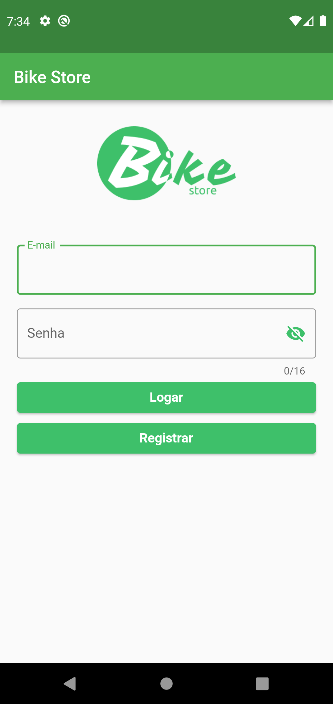

<h1 align="center">
    
</h1>

<p align="center">
<b>Programador Mobile</b><br/>
Aplicação criada para o teste da vaga Programador Mobile promovido pela Voalle.
</p>

<p align="center">
  <a href="#sobre-este-projeto">Sobre este projeto</a>&nbsp;&nbsp;&nbsp;&#149;&nbsp;&nbsp;&nbsp;
  <a href="#funcionalidades">Funcionalidades</a>&nbsp;&nbsp;&nbsp;&#149;&nbsp;&nbsp;&nbsp;
  <a href="#screenshots">Screenshots</a>&nbsp;&nbsp;&nbsp;&#149;&nbsp;&nbsp;&nbsp;
  <a href="#estrutura-do-projetop">Estrutura do projeto</a>&nbsp;&nbsp;&nbsp;&#149;&nbsp;&nbsp;&nbsp;
  <a href="#tecnologias">Tecnologias</a>
</p>

## Sobre Este Projeto

Este projeto consiste na criação de uma aplicação com suporte Android e IOS que possibilite ao usuário visualizar e adicionar itens ao portfólio da aplicação.

Este projeto não possui envolvimento com o grupo Voalle.

## Funcionalidades

- Login
  - Registro com Nome, E-mail e Senha

- Catálogo de Itens
  - Espaço para registrar novos Produtos
  - Inclusão de imagem através de URL externa
  - Alteração de itens cadastrados
  - Exclusão de itens cadastrados

## Screenshots

       

     


## Estrutura do projeto


```bash
...
├── lib                   # Contém código fonte do projeto
│   ├── app                 
│   │   ├── controller    # Contém o codigo de controle dos Widgets
│   │   │	├── edicao_produtos_controler.dart
│   │   │	├── login_controler.dart
│   │   │	├── user_register_controler.dart
│   │   ├── database      # Contém código referente ao banco de dados
│   │   │	├── dao         # Contém as classes de acesso aos dados (data access object)
│   │   │	├── produto_dao.dart
│   │   │	└── usuario_dao.dart
│   │   │	└──app_database.dart
│   │   ├── models      # Classes modelo guardam as variaveis utilizadas no controle
│   │  	├── edicao_produtos_model.dart
│   │  	├── login_model.dart
│   │  	├── modelo_produto.dart
│   │  	├── modelo_usuario.dart
│   │   └── user_register_model.dart
│   │   └── view        # Componentes Widget e elementos visuais 
│   │   │	  ├── pages   # Elementos Visuais formados na tela
│   │   │	├── edicao_produtos_page.dart
│   │   │	├── login_page.dart
│   │   │	├── user_register_page.dart
│   │   │	└── user_register_widget.dart
│   │  	├── edicao_produtos_widget.dart
│   │  	├── login_widget.dart
│   │  	└── main_page.dart
│   ├── Assets          # Contém imagens para decoração do app
│   │  	└── Logo.png
│   └── main.dart
...
```

## Tecnologias

Este projeto foi realizado utilizando as seguintes tecnologias:

- [Flutter](https://flutter.dev/)
- [Sqflite](https://github.com/tekartik/sqflite/blob/master/sqflite/README.md)

